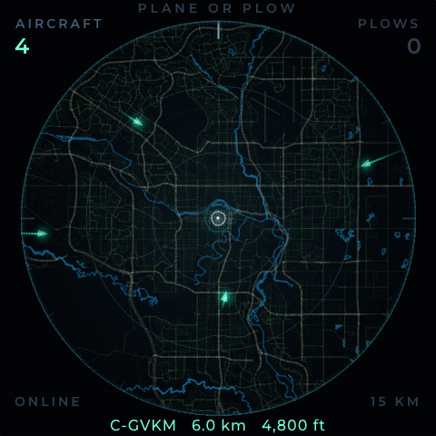
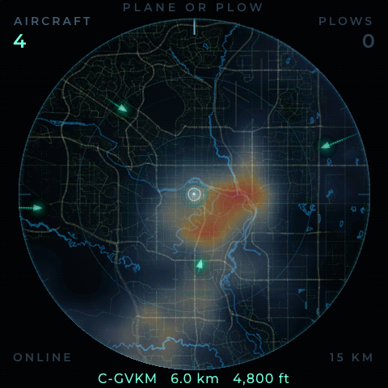

# Plane or Plow

An ambient radar scope for one house. It shows the aircraft and snowplows
within 15 km, and the snow on its way, on a 480×480 panel that sits in a room
and glows.

<p align="center">
  
  
</p>

<p align="center"><em>Demo location: downtown Calgary. Clear, and with precipitation.</em></p>

It started as a question. In winter you hear something outside — low, droning,
scraping — and you want to know whether that was a plane or a plow. This
answers it, and then keeps answering questions you didn't ask: what that
aircraft is, how high, whether the snow overhead is getting heavier, whether
anything is coming.

## What it shows

- **Aircraft** from [airplanes.live](https://airplanes.live), as triangles
  pointing along their track, dead-reckoned between fixes so they glide rather
  than jump. Callsign, distance and altitude for the nearest one. Ground
  traffic is filtered out — see below.
- **Snowplows** from [Alberta 511](https://511.alberta.ca), trailing the
  highway they're working.
- **Precipitation** from [Environment Canada GeoMet](https://eccc-msc.github.io/open-data/msc-geomet/readme_en/),
  cool for ordinary snow and heating through white into amber and red for
  heavy cells. Tap to replay the last hour.
- **An inbound cue** on the rim when something is heading your way from beyond
  the scope, breathing faster the closer it gets.
- **A basemap** from OpenStreetMap: rivers, range roads, town streets and
  highways, composited once at boot.

Two sonar rings expand from home on an 8.5 s cycle; contacts ping as a pulse
crosses their range. Brightness is scheduled, not controlled — on at 07:30,
off at 23:00, easing over 1.6 s rather than stepping.

## Hardware

| | |
|---|---|
| **Board** | ESP32-S3 with 16 MB flash and 8 MB OPI PSRAM |
| **Panel** | Sold as the **ESP32-4848S040**: 4.0" 480×480 IPS, ST7701 over an RGB565 parallel bus |
| **Touch** | GT911 capacitive, I²C |
| **Backlight** | Single PWM pin (GPIO 38) |
| **Power** | USB-C, ~5 V 500 mA |

PSRAM is not optional. The renderer keeps three full 480×480×2 framebuffers —
the static basemap, the basemap composited with precipitation, and the live
frame — which is 1.4 MB, plus LVGL's draw buffers.

Pin assignments live at the top of [`src/main.cpp`](src/main.cpp). They match
the common ESP32-4848S040 wiring; if your board differs, that's the file.

## Setup

The `espressif32` platform is pinned to 6.12.0 in
[`platformio.ini`](platformio.ini). Unpinned it resolves to 53.x / Arduino core
3.x, where the LEDC and Arduino_GFX APIs this uses have been renamed and the
build fails outright.

**1. Install [PlatformIO](https://platformio.org/install/cli)**

```bash
pip install platformio
```

**2. Configure it for your location**

One script geocodes the address, writes your credentials, and pulls the
basemap from OpenStreetMap:

```bash
python3 tools/configure.py \
    --address "Cochrane, Alberta" \
    --ssid    "MyNetwork" \
    --password "hunter2"
```

Or skip the geocoder:

```bash
python3 tools/configure.py --lat 51.0447 --lon -114.0719 --radius 20
```

That writes two files, both gitignored:

- `src/secrets.h` — WiFi, scope centre, radius, timezone
- `src/roads_data.h` — the basemap, simplified and classified

Re-run it whenever you move the scope, change the radius, or want fresher map
data; anything you don't pass again is preserved. `--skip-map` rewrites only
the credentials. `--tz` takes a POSIX timezone (`MST7`, `PST8PDT`,
`GMT0BST,M3.5.0/1,M10.5.0`) for the backlight schedule.

**3. Build and flash**

```bash
pio run -t upload
pio run -t monitor        # optional; 115200 baud
```

A healthy first boot looks like:

```
Reset reason: 1 (power-on)   free heap 294720
Background composited in 885 ms
Radar: 64x64 over 33 km, 10-frame history
Scope ready: 14.5 px/km, range 15 km
WiFi connected: 192.168.1.42 (RSSI -57)
Status: http://planeorplow.local/status
Plane or Plow — scope ready
Radar tile 64x64 (33km): 1131 bytes, 1051 cells, 21 ms, heap 252472, stack left 12556
Airplanes: 5 in API, 5 in range, 5 tracked
```

The `Invalid pin selected` and `gpio_set_level(227)` complaints during panel
init are normal for this board and harmless.

## Checking on it

```bash
curl http://planeorplow.local/status
```

JSON: uptime, why the last run ended, heap, PSRAM, loop-task stack headroom,
WiFi state, contact counts, radar fetch and failure counters, backlight state.
Everything reported is a maintained counter, so polling is free.

To find a leak, watch `heap.drift_since_settled` and `heap.min_free` over
hours. The baseline is captured *after* startup allocation finishes — measuring
from boot would read normal initialisation as a 50 KB leak.

`reset_reason` survives a reboot in RTC memory, so an unattended crash is still
diagnosable hours later. `PANIC / exception`, `task watchdog` and
`BROWNOUT (power)` each point somewhere different.

## Regional scope

The snowplow and weather feeds are Albertan. Aircraft work anywhere
airplanes.live has coverage, and the basemap works anywhere OpenStreetMap does.
Elsewhere you'd want to swap two things:

- `PLOW_API_URL` in [`src/config.h`](src/config.h) for your local fleet feed
- The GeoMet radar in [`src/weather.cpp`](src/weather.cpp) for a regional
  equivalent — anything serving WMS tiles will fit the same shape

## How it's put together

| File | |
|---|---|
| `src/main.cpp` | Panel, touch and LVGL bring-up; the loop |
| `src/gfx_draw.cpp` | Anti-aliased RGB565 rasteriser: Wu lines, soft strokes, supersampled polygons, glows, symbol casings |
| `src/ambient.cpp` | The scene — projection, basemap, sonar pulses, contacts, trails, precipitation compositing |
| `src/weather.cpp` | GeoMet radar: fetch, streaming PNG decode, history, replay, wide-area sweep |
| `src/network.cpp` | Aircraft and plow polling, contact tracking |
| `src/hud.cpp` | The corner readouts |
| `src/backlight.cpp` | Scheduled brightness with eased transitions |
| `src/status.cpp` | The `/status` endpoint |
| `src/theme.h` | Every colour in one place |

Some notes on the parts that aren't obvious:

**The basemap is composited once, at boot.** Redrawing thousands of road
segments per frame was most of the original frame cost. Precipitation
composites into a second buffer on the radar's own 6-minute cadence. What
happens per display frame is one `memcpy`.

**The background gradient is dithered.** It spans about five distinct RGB565
levels across the radius, so quantising it directly draws visible concentric
banding. An 8×8 ordered dither hides it.

**Aircraft are dead-reckoned.** A fix every ~27 s would otherwise mean a plane
teleporting across the scope. Track and ground speed carry it between fixes at
30 fps, and its trail is resampled from the interpolated position.

**Water is the only saturated hue on the basemap.** Roads run a neutral
luminance ladder, warm-grey at the top, cooling as they recede — so a river
looks like a river and a highway looks like a road. Aircraft sit at hue 165,
clear of the amber plows at 35, the water at 205, and the precipitation ramp's
pink top end near 325.

**Ground traffic is filtered out.** ADS-B carries more than aircraft: emitter
categories `C0`-`C7` are surface vehicles and obstacles — airport service
trucks, emergency vehicles, tethered balloons — and aircraft parked or taxiing
report `alt_baro` as the string `"ground"`. Neither is going to fly over your
house, and near an airfield they dominate the scope. Both filters are on by
default; flip `FILTER_SURFACE_VEHICLES` / `FILTER_ON_GROUND` in
[`src/config.h`](src/config.h) if you want them back.

**Radar fetches are bounded twice.** They run on the LVGL timer, so every
millisecond spent in one is a millisecond the display is frozen: a 2.5 s stall
timeout and a 9 s ceiling on the whole read.

**There is no heap-fragmentation figure in `/status`, deliberately.**
`heap_caps_get_largest_free_block()` walks and poison-checks every block under
a spinlock that disables interrupts, which the RGB panel's DMA cannot tolerate
— it panics the device.

## Regenerating the radar palette

`src/wx_ramp.h` maps radar tile pixels back to an intensity by sampling
Environment Canada's legend. It only needs regenerating if they change the
palette:

```bash
python3 tools/wx_ramp.py
```

## Credits

- Map data © OpenStreetMap contributors, [ODbL](https://www.openstreetmap.org/copyright)
- Radar © Environment and Climate Change Canada, [GeoMet open data](https://eccc-msc.github.io/open-data/)
- Aircraft via [airplanes.live](https://airplanes.live)
- Plows via [Alberta 511](https://511.alberta.ca)
- Built on [LVGL](https://lvgl.io), [Arduino_GFX](https://github.com/moononournation/Arduino_GFX),
  [pngle](https://github.com/kikuchan/pngle) and [ArduinoJson](https://arduinojson.org)

Be a good neighbour to the free APIs: the defaults poll one source every 20 s
and radar every 6 minutes, which is well within what they ask for. If you
shorten those intervals, you're the reason they get rate limited.

airplanes.live gates access by client, and will return HTTP 403 with a message
asking you to email them about your project. If you see that, do exactly
that — they are reasonable, and the alternative is everyone hammering an
endpoint that costs someone money to run.

## License

MIT — see [LICENSE](LICENSE).
